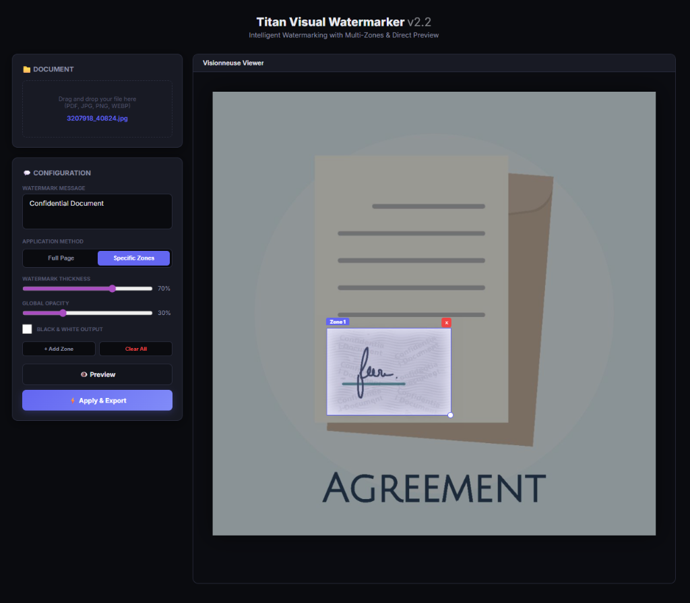
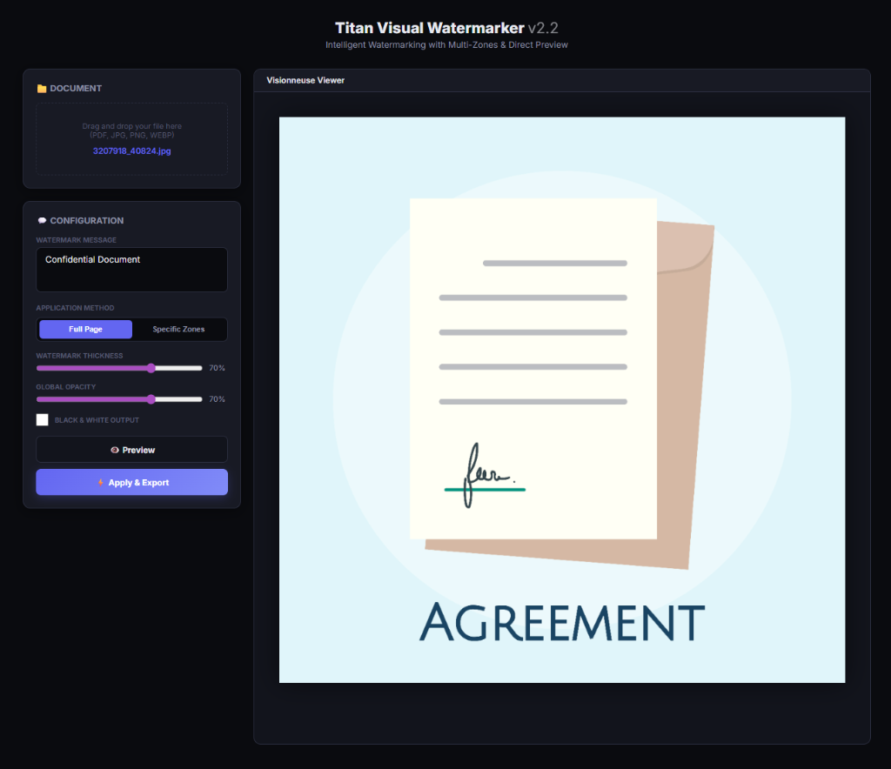
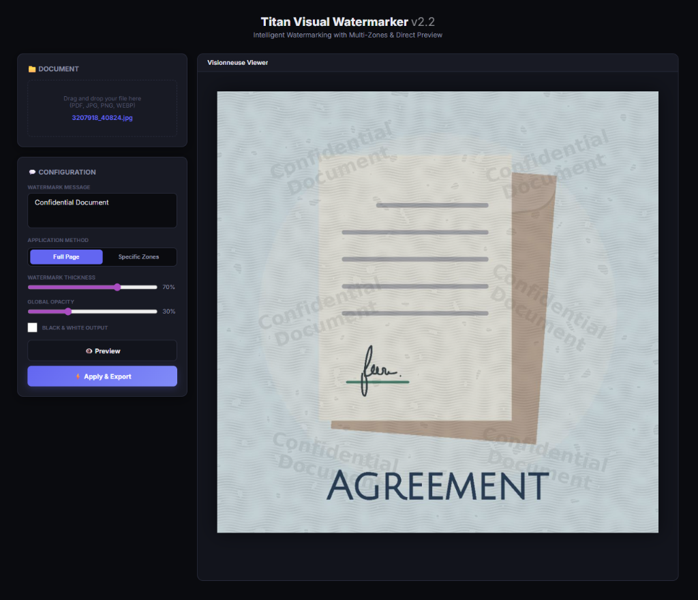

# Titan: High-Security Adversarial Watermarker

[](Dockerfile)
[](requirements.txt)
[](LICENSE)

**Titan** is a professional-grade visual watermarking service designed to combat the rising threat of AI-based watermark removal tools. While traditional watermarks can be easily erased by modern inpainting algorithms, Titan uses **adversarial image processing** to embed information into the structural fabric of the document.

---

## 📸 Interface Preview


*Modern, dark-mode interface for precise document protection.*

---

## 🛡️ The Theory: Why Traditional Watermarks Fail

In the age of Generative AI, traditional watermarks are no longer sufficient. Tools like **Adobe Firefly, Midjourney Inpainting, and specialized erasure models** can remove standard watermarks in seconds.

### 1. The Separation of Layers
Most watermarks are applied as a digital overlay (a separate layer of pixels). AI models are trained to identify these high-contrast, mathematically perfect edges that do not share the same noise or texture characteristics as the underlying document. Once identified, they are treated as "noise" to be removed.

### 2. The Structural Reconstruction
Modern AI erasure doesn't just "blotch" out the watermark. Inpainting algorithms analyze the surrounding text lines, paper textures, and gradients. They "predict" what was behind the watermark. If the background structure (like a wave pattern or text line) continues perfectly behind the watermark, the AI can reconstruct it with 99% accuracy.

### 3. The Digital Signature
Pure digital black (#000000) or uniform opacity are signatures that models detect instantly. Real ink has "blooming" (bleeding into fibers), varying saturation, and interacts with the paper's luminance.

---

## 🚀 The Titan Solution: Adversarial Resistance

Titan shifts the paradigm from "Overlaying" to **"Structural Deformation"**.

### 1. Phase-Modulated Interference (Adversarial Waves)
Titan generates a field of wavy interference patterns across the document. Crucially, the watermark message doesn't just sit on top; it **distorts the phase** of these waves.
- **Why it works**: If an AI tries to erase the watermark, it is left with "broken" waves. Since the waves were never straight in the pixel data, the AI has no reference to reconstruct the "undistorted" background. The distortion *is* the watermark.

### 2. Analog Ink Simulation (Physical Physics)
Titan uses a physics-inspired rendering pipeline to mimic a physical stamp:
- **Ink Blooming**: Simulates how ink bleeds into paper fibers, creating organic, soft transitions that confuse edge-detection.
- **Micro-Voids**: Injects high-frequency noise into the ink to simulate uneven pressure and texture.
- **Structural Bleeding (Paper Warp)**: Actually displaces the background document pixels at the edges of the text, simulating physical fiber wetting.

### 3. Luminance-Anchored Blending
Instead of a fixed color, Titan's "ink" is a relative shadowing of the local document brightness.
- **Chroma Matching**: The ink is subtly tinted with the document's own average color.
- **Sensor Grain Matching**: We inject simulated ISO sensor noise that matches the document's grain, preventing AI "layer separation" algorithms from distinguishing the watermark as a separate entity.

---

## ✨ Features Showcase

````carousel

<!-- slide -->

````

- **Multi-Zone Selective Watermarking**: Protect sensitive areas like signatures or bank details specifically.
- **Full-Page Wave Interference**: Create a global density that makes mass reconstruction computationally expensive for AI.
- **PDF & Image Support**: Professional-grade fidelity for both office documents and photography.
- **Black & White Mode**: Optimized for high-contrast professional delivery.

---

## 🛠️ Installation & Deployment

### Quick Start
1. Clone the repository:
   ```bash
   git clone https://github.com/ThomasC-IUT/titan-watermarker.git
   cd titan-watermarker
   ```
2. Launch with Docker Compose:
   ```bash
   docker-compose up -d --build
   ```
3. Access the dashboard at **[http://localhost:8000](http://localhost:8000)**.

## 📖 Technical Deep Dive
For a full breakdown of the algorithms, see the [Technical Specifications](specifications.md).

---
*Developed for professionals requiring high-assurance document protection in the era of Generative AI.*
Tip: Test your documents with tools such as https://visualgpt.io/watermark-remover